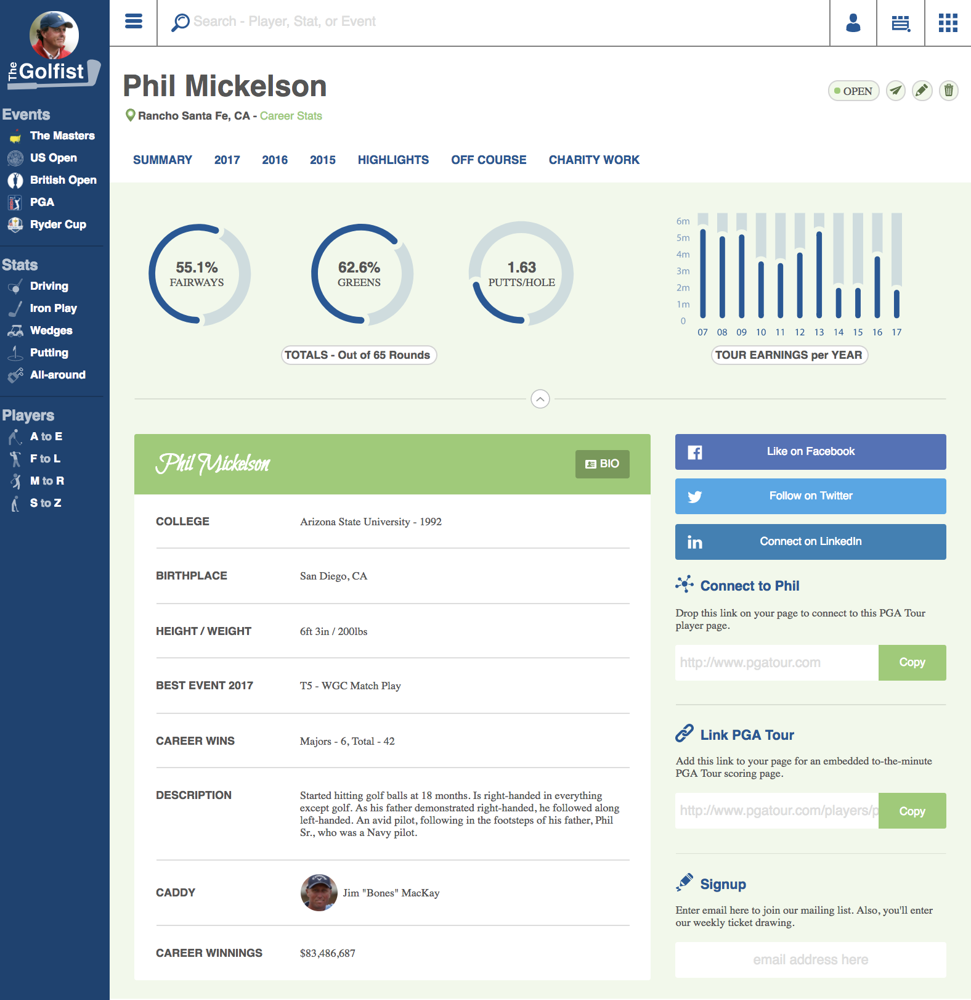

Rob Morgan - Static Comp 3

This is a static webpage built for Turing School of Software & Design.

Live version: https://rmorgan323.github.io/rm-comp-challenge-3/

The primary effort I made in this static comp was solid functionality on all screen sizes.  So I was very careful in how I designed the page and how it was laid out in order to make it work in any circumstance.  It was challenging.  Every component, from the nav to the header, all the way through the various content blocks had to be considered on different screen sizes.  The functionality turned out very well.  The page is carefully crafted and works well everywhere.  But due to how much is going on, there is a lot of css--over 1000 lines worth.  It uses css grid in one section of the page and flexbox in many places.  There is fixed positioning for the nav until it gets to smaller screens.

I made 4 major breakpoints: 1024px, 1024px, 768px, and 496px.  There is no two-dimensional scaling of elements--they simply move around to best fit the screen.  The nav elements move from a list to a dropdown in two different sections of the page.  

I chose challenging colors, trying to go with blue and green for a golf-themed page.  I tried several different blues and greens and settled on these.  In hindsight, it was a much more challenging color palette than I used for other static comps.

My version

